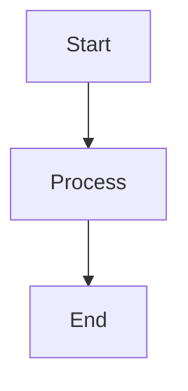

# Mermaid Exporter

**Easily export your Mermaid diagrams from Obsidian as beautiful, high-quality images.**

Mermaid Exporter adds a simple export button to every Mermaid diagram in your notes, letting you save your diagrams as SVG, PNG, or JPEG files with just one click. Perfect for sharing diagrams in presentations, documentation, or anywhere else you need them.

## ✨ Features

- **One-Click Export** - Export any Mermaid diagram instantly with a single button click
- **Multiple Formats** - Choose from SVG (vector), PNG, or JPEG formats
- **High Quality** - Export diagrams at customizable resolutions for crisp, professional results
- **Customizable Settings** - Configure default export location, filename format, and quality settings
- **Seamless Integration** - Works automatically with all your existing Mermaid diagrams

## 🚀 Quick Start

1. **Install the plugin** (see Installation below)
2. **Create or view a Mermaid diagram** in any note
3. **Click the export button** that appears below your diagram
4. **Download your diagram** - it's that simple!

## 📦 Installation

### Recommended: Install from Community Plugins

1. Open **Settings** in Obsidian (⚙️ icon or `Cmd/Ctrl + ,`)
2. Navigate to **Community Plugins**
3. Click **Browse** to open the community plugins browser
4. Search for **"Mermaid Exporter"**
5. Click **Install**, then **Enable**

That's it! The plugin is now active and ready to use.

### Manual Installation

If you prefer to install manually:

1. Download the latest release from the [Releases page](https://github.com/YOUR_USERNAME/obsidian-mermaid-exporter/releases)
2. Extract the downloaded zip file
3. Copy the extracted folder to your vault's `.obsidian/plugins/` directory
4. Reload Obsidian (`Cmd/Ctrl + R` or restart the app)
5. Go to **Settings → Community Plugins** and enable **Mermaid Exporter**

## 📖 How to Use

### Step 1: Create a Mermaid Diagram

Create a Mermaid diagram in any note using a code block:

````markdown

````

### Step 2: Export Your Diagram

1. View your note in **Reading mode** (or **Live Preview**)
2. Look for the **export button** that appears below your rendered Mermaid diagram
3. Click the button to instantly download your diagram

The export button appears right below the "Edit this block" button, making it easy to find and use.

## ⚙️ Settings

Customize Mermaid Exporter to fit your workflow:

**Access Settings:** Settings → Community Plugins → Mermaid Exporter

### Available Options

- **Export Format** - Choose your preferred format:
  - **SVG** - Vector format, perfect for scaling and editing
  - **PNG** - Raster format, great for presentations and documents
  - **JPEG** - Compressed format, smaller file sizes

- **Export Quality** - Adjust the resolution/quality of exported images (higher quality = larger file size)

- **Default Export Location** - Set a default folder where exported diagrams are saved

- **Filename Format** - Customize how exported files are named (e.g., include date, diagram title, etc.)

## 💡 Tips

- **SVG format** is recommended for diagrams you plan to edit or scale
- **PNG format** works best for presentations and documents
- Use **JPEG** when file size is a concern
- Exported files maintain the exact appearance of your rendered diagrams

## 🐛 Troubleshooting

**Export button not appearing?**
- Make sure you're viewing the note in Reading mode or Live Preview
- Ensure the Mermaid diagram is properly rendered (check for syntax errors)
- Try reloading Obsidian (`Cmd/Ctrl + R`)

**Export not working?**
- Check that the plugin is enabled in Settings → Community Plugins
- Verify you have write permissions in the export location
- Try changing the export format in settings

## 🤝 Support

Found a bug or have a feature request? We'd love to hear from you!

- [Open an issue on GitHub](https://github.com/YOUR_USERNAME/obsidian-mermaid-exporter/issues)
- Check existing issues to see if your question has already been answered

## 📄 License

MIT License - feel free to use, modify, and distribute as needed.

---

**Made with ❤️ for the Obsidian community**

---
